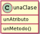
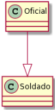
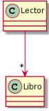
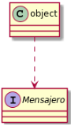
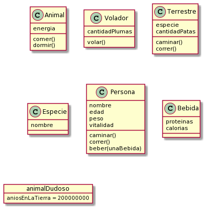
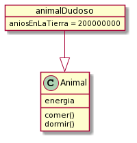
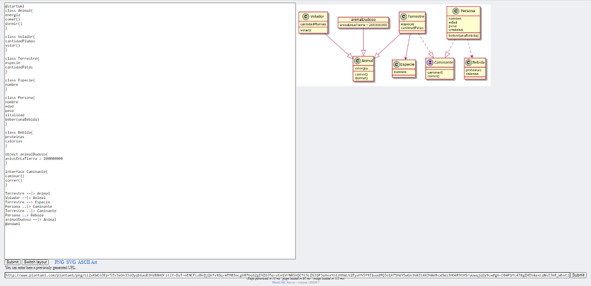

# Guía Rápida de PlantUML
---

## Cómo arrancar
Entrar al [**link de la herramienta**](https://plantuml.com/es/class-diagram) y elegir algún molde de los que nos proporcionan cliqueando en **Edit Online**.
Ejemplo: 


Al entrar vamos a tener la siguiente vista, en la que se podrán identificar varias cosas:
- A simple vista, se ve que hay que "codear" el diagrama; tiene pinta de ser más complejo que simplemente dibujar el diagrama o utilizar lucid-chart. La realidad es que una vez conocida la sintaxis, se vuelve mucho más sencillo generar los diagramas (ya que es la herramienta la que los genera y ordena).


El detalle de los items es el siguiente: 
1. Código del diagrama, será entendido por un intérprete que nos genera el diagrama del item 3.
2. Vistas del diagrama en imágen y ASCII Art. Se recomienda SVG para diagramas grandes.
3. Diagrama de clases generado.
4. Este espacio sirve para introducir un link de un uml ya generado (mismo puede servir para que ustedes para guardarse un diagrama que quieran modificar más tarde). 
5. Al darle submit, se generará el código de Diagrama del link introducido. 
6. Al realizar cambios en el código del item 1. se debe precionar submit para actualizar el diagrama.
7. Switch Layaout nos permite cambiar entre la vista normal y de pantalla dividida. 

___
## Sintaxis básico
Antes de arrancar cualquier diagrama, tenemos que agregar esto: <br>
@startuml

'Nuestro código va aca!'

@enduml
|Elemento|Sintaxis|Representación|
|--------|:------:|:------------:|
|Clase   |Class UnaClase {<br>unAtributo <br> unMetodo() <br>...<br>}||
|Interface|Interface UnaInterface{<br>unMetodo() <br>...<br>}||
|Clase abstracta|Abstract unaClaseAbstracta {<br>unAtributo <br> unMetodo() <br>...<br>}||
|WKO|object unObjeto{<br>unAtributo <br> unMetodo() <br>...<br>}||
|Método|unMetodo()|||
|Atributo|tipo\* unAtributo|||

\*A la hora de poner atributos podemos especificar el tipo y el acceso (private/public). En wollok no le ponemos tipo ya que es un lenguaje con tipado dinámico.
De hecho, podríamos poner cualquier cosa, lo importante es que para nosotros se entiende que es un atributo, y si tiene () es un mensaje.
Un ejemplo medio "falopa" para ver que se puede poner lo que se quiera es:
<br>
 <br>
La idea no es poner lo que se quiera, sino algo que tenga sentido, como por ejemplo la clase de la izquierda.
## Relaciones

|Relacion|Sintaxis|Ejemplo|Representacion|
|--------|--------|--------|--------------|
|Herencia| --\|\> |Oficial --\|\> Soldado||
|Conocimiento| -->"multiplicidad"|Lector -->"\*" Libro||
|Implementación|..\|\>|Corsa ..\|\> Rodado||
|Dependencia|..>|paquete ..> Mensajero||

## Ejemplo - Animales

### Enunciado
Se desea hacer una aplicación en wollok que modele el comportamiento de los animales. De ellos conocemos su energía, saben comer y dormir.
Los animales pueden ser voladores y terrestres. Los animales voladores saben volar y conocen la cantidad de plumas que tienen. Los animales terrestres saben caminar, correr y conocen la cantidad de patas que tienen y su especie. De las especies solo se conoce su nombre.
También hay personas de las que conocemos su nombre, edad , peso y vitalidad, saben caminar y correr (igual que los animales terrestres) pero también saben tomar una bebida que se les de que les sube la vitalidad y el peso según la cantidad de calorías y proteínas que tenga.
Por último conocemos a un animal de dudosa provenencia (no se sabe si es terrestre o volador), se conoce además de su energía, la cantidad de años que lleva en el planeta tierra que es igual 200 millones. Sabe hacer las mismas cosas que los otros animales.


### Código
Tenemos el siguiente código en wollok para solucionar el problema planteado. No vamos a fijarnos en si la implementación puede ser mejorada ya que queremos concentrarnos solo en el diagrama estático.
También asumiremos algunas cosas del comportamiento que agregan los mensajes que entienden los objetos.
```wollok
class Animal{
var energia

  method energia() = energia

  method comer(cantidad){
  energia += cantidad
  }
  
  method dormir(){
  energia += 10
  }
  
  
}

class Volador inherits Animal{
  var cantidadPlumas
  
  method cantidadPlumas() = cantidadPlumas
  method volar(){
  energia -= 20
  }
 
}

class Terrestre inherits Animal{
const property especie
const property cantidadPatas

  method caminar(){
  energia -= 10
  }
  
  method correr(){
  energia -= 30
  }
  
  
}

class Especie{
  const property nombre
}

class Persona{
  
const property nombre
var edad
var peso
var vitalidad
  
  method caminar(){
  vitalidad -= 10
  peso -= 0.001
  }
  
  method correr(){
  vitalidad -=20
  peso -= 0.01
  }
  
  method beber(unaBebida){
  vitalidad += unaBebida.proteinas()*0.1
  peso += unaBebida.calorias()*2
  }
 
}

class Bebida{

const property proteinas
const property calorias

}

object animalDudoso inherits Animal{
  const property aniosEnLaTierra = 200000000
}
```
### Diagrama de clases

Vamos de a poco! Primero podemos representar el código que nos dan en un diagrama, para eso vamos a tirar en plantuml el siguiente código:

```plantuml
class Animal{
energia
comer()
dormir()
}

class Volador{
cantidadPlumas
volar()
}

class Terrestre{
especie
cantidadPatas
caminar()
correr()
}

class Especie{
nombre
}

class Persona{
nombre
edad
peso
vitalidad
caminar()
correr()
beber(unaBebida)
}

class Bebida{
proteinas
calorias
}

object animalDudoso{
aniosEnLaTierra = 200000000
}
```

Esto resultaría en el siguiente diagrama:
<br> 

Pará! Nos falta algo... no? Sí, las relaciones. Las vamos encarando de a poquito:

1. Terrestre y Volador heredan de Animal

```plantuml
Terrestre --|> Animal
Volador --|> Animal
```


2. El Animal Terrestre conoce su especie
```plantuml
Terrestre --> Especie
```


3. La persona sabe caminar y correr igual que el animal terrestre, por lo que tienen una interfaz en común para esos mensajes. Además, la persona usa a la bebida (o depende de ella).

```plantuml
interface Caminante{
caminar()
correr()
}

Terrestre ..|> Caminante
Persona ..|> Caminante
Persona ..> Bebida

```


4. El animal dudoso es un animal más, pero no sabemos si es volador o terrestre. 
```plantuml
animalDudoso --|> Animal
```


Como resultado de todas estas adiciones, nos queda el siguiente diagrama. Con este damos por finalizado el ejercicio.


Por último podemos ver cómo se generó todo esto en la herramienta web:




## Link uml terminado
También dejamos el link del uml para poder probarlo. Solo tienen que pegarlo en contenedor que está debajo de todo y apreta el botón Submit de la esquina inferior derecha. (Puntos 4 y 5 de la explicación inicial).


http://www.plantuml.com/plantuml/png/LL2xKWCn3Epr5Iv3aGn3JoOyqb6aoD3hV88HOritiY-DuT-nENCFLzBkQjQxfvXGq-WTM8SncgV07bq62gIVZ635a-xke1VrN8SVQCftSLZG31P3uXxxYnizHhWLV2EyaYh5f9I1ua2MQJd1X75HdYSwGn3VAIt4XJHAm9cWSWi3HO4R9tHSruuwqjqOy9cw0gm-C04P1fL478gZHIVAaxLqNsIJmR_WhsClKJAKJU8vlE6LIHNDetcuRw_US4Ya7sZ9lA3dW6MjFTInHhUYIgs3ERtPxx-FhLzevQsnZVButmMqwEPmAChPRH5lYRN-s8B3Ejh6yKIX7xtx1G00
