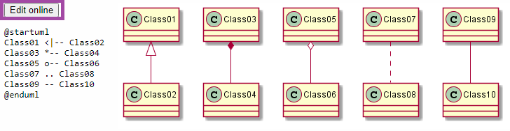
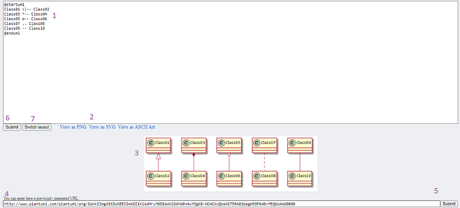
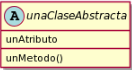
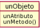
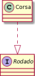

# Guía Rápida de PlantUML
---

## Cómo arrancar
Entrar al [**link de la herramienta**](https://plantuml.com/es/class-diagram) y elegir algún molde de los que nos proporcionan cliqueando en **Edit Online**.
Ejemplo: 

Al entrar vamos a tener la siguiente vista, en la que se podrán identificar varias cosas:
- A simple vista, se ve que hay que "codear" el diagrama; tiene pinta de ser más complejo que simplemente dibujar el diagrama o utilizar lucid-chart. La realidad es que una vez conocida la sintaxis, se vuelve mucho más sencillo generar los diagramas (ya que el la herramienta la que los genera y ordena).

El detalle de los items es el siguiente: 
1. Código del diagrama, será entendido por un intérprete que nos genera el diagrama del item 3.
2. Vistas del diagrama en imágen y ASCII Art. Se recomienda SVG para diagramas grandes.
3. Diagrama de clases generado.
4. Este espacio sirve para introducir un link de un uml ya generado (mismo puede servir para que ustedes para guardarse un diagrama que quieran modificar más tarde). 
5. Al darle submit, se generará el código de Diagrama del link introducido. 
6. Al realizar cambios en el código del item 1. se debe precionar submit para actualizar el diagrama.
7. Switch Layaout nos permite cambiar entre la vista normal y de pantalla dividida. 

___

## Sintaxis básico

|Elemento|Sintaxis|Representación|
|--------|:------:|:------------:|
|Clase   |Class UnaClase { unAtributo   unMetodo()  ... }||
|Interface|Interface UnaInterface{ unMetodo()  ... }||
|Clase abstracta|Abstract unaClaseAbstracta { unAtributo   unMetodo()  ... }||
|WKO|object unObjeto{ unAtributo   unMetodo()  ... }||
|Método|unMetodo()|||
|Atributo|tipo unAtributo|||

## Relaciones

|Relacion|Sintaxis|Ejemplo|Representacion|
|--------|--------|--------|--------------|
|Herencia| --\|\> |Oficial --\|\> Soldado||
|Conocimiento| -->"multiplicidad"|Lector -->"\*" Libro||
|Implementación|..\|\>|Corsa ..\|\> Rodado||
|Dependencia|..>|paquete ..> Mensajero||

## Ejemplo - Age of Empires

Se desea modelar el comportamiento básico del Age of Empires. Conocemos Unidades militares de las que se conoce su vida, ataque y defensa. 

